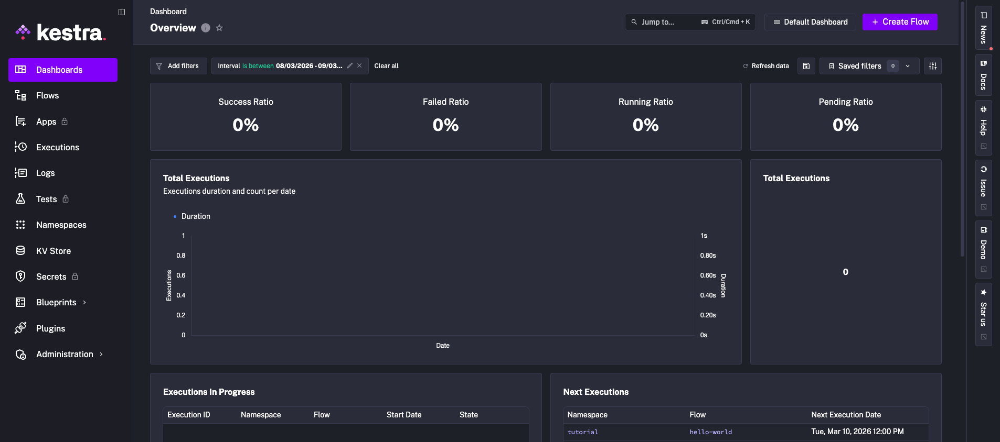
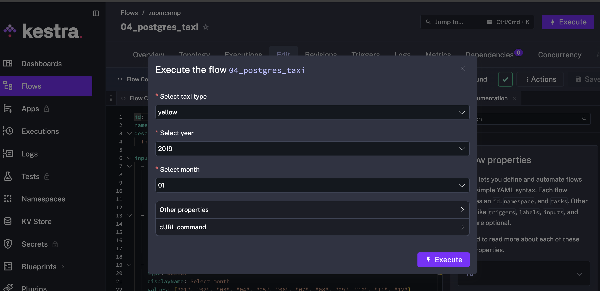
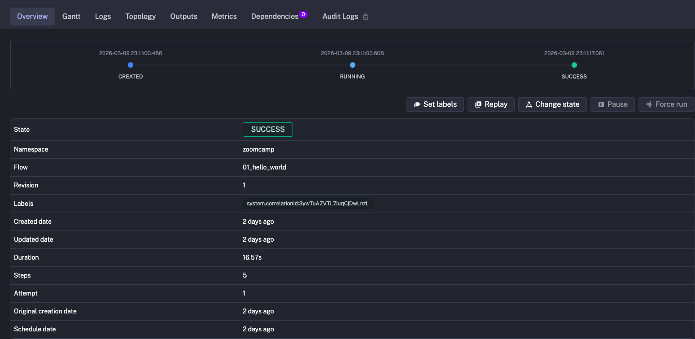
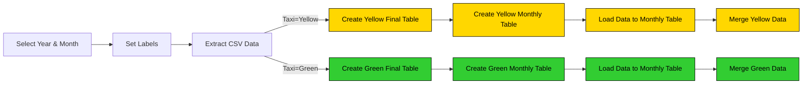
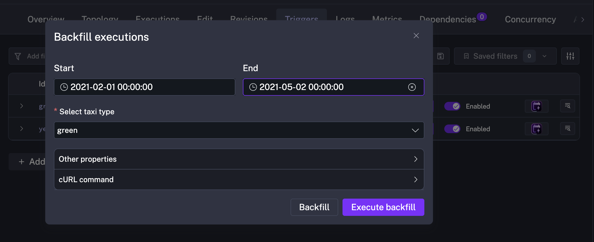
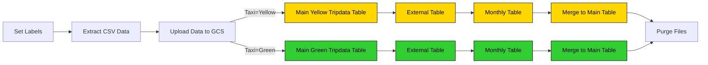

# Workflow Orchestration with Kestra

This repository contains documentation, configurations, and workflows for orchestrating data engineering lifecycles using **Kestra**. It covers everything from local setup with Docker to advanced ELT patterns using Google Cloud Platform (GCP).

---

## Table of Contents

- [Overview](#overview)
- [Getting Started](#getting-started)
- [Key Concepts](#key-concepts)
- [Building Data Pipelines](#building-data-pipelines)
- [Advanced: ELT with GCP](#advanced-elt-with-gcp)
- [Files in this Repository](#files-in-this-repository)

---

## Overview

Orchestration is the process of **dependency management facilitated through automation**. In data engineering, it manages the scheduling, triggering, monitoring, and resource allocation of ETL/ELT workflows. Every workflow consists of:

- **Steps = Tasks** (called blocks in Mage)
- **Workflows = DAGs** (Directed Acyclic Graphs) or Pipelines

### Why Kestra?

Kestra is an open-source, event-driven orchestration platform that adopts **Infrastructure as Code (IaC)**. It allows you to build reliable workflows using simple YAML files that:

- Run workflows containing predefined steps
- Monitor and log errors, retrying automatically on failure
- Trigger workflows on schedules or external events

### Features of a Good Orchestrator

| Category | Capabilities |
|---|---|
| **Reliability** | Error handling, data recovery, retries |
| **Operations** | Monitoring & alerting, resource optimization, compliance & auditing |
| **Developer Experience** | Observability, debugging, fast feedback loops, reduced cognitive load |

---

## Getting Started

### Prerequisites

- Docker and Docker Compose installed
- Ports `8080` and `5432` available (ensure pgAdmin is not running on the same ports)

### Quick Start

1. Navigate to the project directory.
2. Spin up the Kestra server and Postgres database:

```bash
docker compose up -d
```

3. Access the Kestra UI at [http://localhost:8080](http://localhost:8080).

**Credentials:**
- **Username:** `admin@kestra.io`
- **Password:** `Admin1234!`



To shut down the environment:

```bash
docker compose down
```

---

## Key Concepts

| Concept | Description |
|---|---|
| **Flow** | A container for tasks and orchestration logic, defined in YAML. |
| **Tasks** | The atomic steps within a flow where actions and transformations occur. |
| **Inputs / Outputs** | Mechanisms to pass dynamic values into and between tasks at runtime. |
| **Triggers** | External events or schedules that initiate a flow execution. |
| **Variables** | Reusable key-value pairs shared across tasks. |
| **Plugin Defaults** | Global configurations applied to all tasks of a given type. |
| **Concurrency** | Controls how many instances of a flow can run simultaneously (`QUEUE`, `CANCEL`, or `FAIL`). |

### Example: Hello World Flow

```yaml
id: simple_hello_world
namespace: zoomcamp
tasks:
  - id: hello_message
    type: io.kestra.plugin.core.log.Log
    message: "Hello world!"
```

> **Note:** A flow's `id` and `namespace` cannot be changed after creation. To rename, create a new flow with the desired values and delete the old one.

### Inputs & Datatypes

Inputs allow flows to be reused with different values each execution. Supported types include `STRING`, `INT`, `FLOAT`, `SELECT`, `BOOLEAN`, `DATETIME`, and `URI`.

```yaml
inputs:
  - id: salutation
    type: STRING
    defaults: "Hello world!"
    required: true
```



Reference inputs in tasks using double curly braces:

```yaml
tasks:
  - id: hello_message
    type: io.kestra.plugin.core.log.Log
    message: "{{ inputs.salutation }}"
```

### Triggers

| Type | Description |
|---|---|
| **Schedule** | Runs flows at fixed intervals using cron expressions. |
| **Flow** | Triggers when another flow completes. |
| **Webhook** | Triggers via an authenticated HTTP request. |
| **Polling** | Checks an external service for pending data. |
| **Real-time** | Reacts to events with millisecond latency. |

```yaml
triggers:
  - id: schedule
    type: io.kestra.plugin.core.trigger.Schedule
    cron: "@hourly"
    allowConcurrent: false
```

### Executions & Observability

Every flow run generates a detailed execution record showing duration, task outputs, and any retries — making debugging fast and efficient.



---

## Building Data Pipelines

The following pipeline extracts **NYC Taxi CSV data** (Yellow & Green), creates partitioned staging tables in Postgres, and merges new data into a destination table.

### Pipeline Architecture



### Scheduling & Backfills

To automate monthly runs, cron triggers are configured for each taxi type:

```yaml
triggers:
  - id: green_schedule
    type: io.kestra.plugin.core.trigger.Schedule
    cron: "0 9 1 * *"
    inputs:
      taxi: green

  - id: yellow_schedule
    type: io.kestra.plugin.core.trigger.Schedule
    cron: "0 10 1 * *"
    inputs:
      taxi: yellow

concurrency:
  limit: 1
```

Kestra also supports **Historical Backfills** via the UI — re-running logic for past date ranges (e.g., loading all 2021 data) based on the cron schedule's would-have-triggered dates.



---

## Advanced: ELT with GCP

This approach shifts from ETL to **ELT**, prioritizing cost-effectiveness and flexibility by leveraging **Google Cloud Storage** (Data Lake) and **BigQuery** (Data Warehouse).

### The ELT Workflow

| Step | Description |
|---|---|
| **Extraction** | Download CSV files from source. |
| **Loading** | Upload raw, unmodified files to GCS Buckets. |
| **Transformation** | Perform on-the-fly transformations using BigQuery SQL. |



### Setup for GCP

1. Base64-encode your GCP service account JSON and add it to your `.env` file:

```bash
echo SECRET_GCP_SERVICE_ACCOUNT=$(cat gcp_credentials.json | base64 -w 0) >> .env
```

2. Map the variable in your `docker-compose.yml` under the Kestra service:

```yaml
kestra:
  environment:
    SECRET_GCP_SERVICE_ACCOUNT: ${SECRET_GCP_SERVICE_ACCOUNT}
```

3. Run the provided `gcp_kv.yaml` flow to initialize your GCP variables in the Kestra KV Store:
   - `GCP_PROJECT_ID`
   - `GCP_LOCATION`
   - `GCP_BUCKET_NAME`
   - `GCP_DATASET`

---

## Files in this Repository

| File | Description |
|---|---|
| `docker-compose.yml` | Kestra server and Postgres container setup |
| `Postgres_taxi.yaml` | Local Postgres ETL orchestration flow |
| `postgres_schedules_backfills.yaml` | Scheduled local workflow with backfill support |
| `gcp_kv.yaml` | GCP Key-Value store configuration helper |
| `gcp_taxi.yaml` | Basic GCP ELT flow (GCS + BigQuery) |
| `gcp_taxi_scheduled.yaml` | Production-ready GCP flow with scheduling |